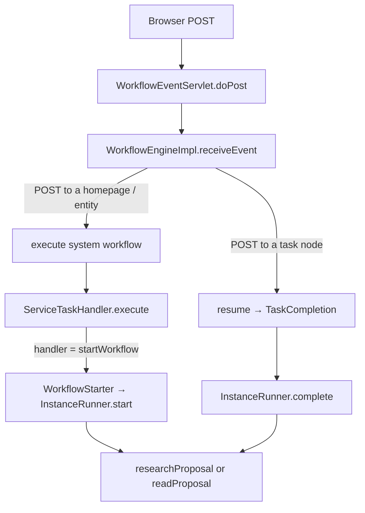
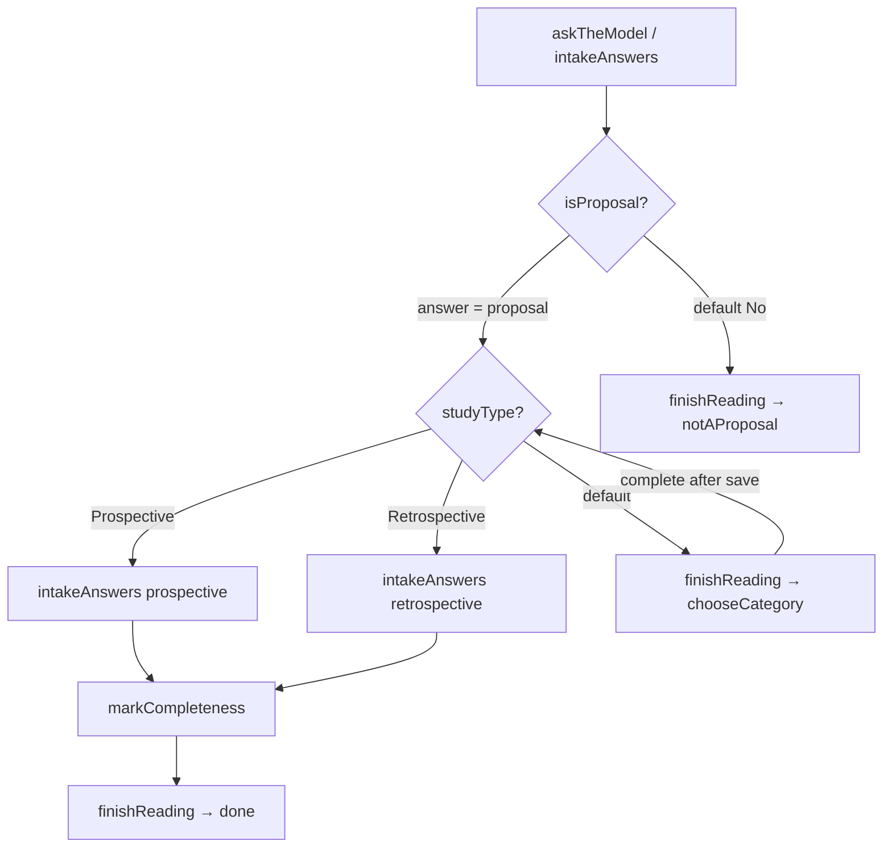

# Who calls whom during a research-proposal submission

Every POST into a submission goes through one door. After that the engine either runs a **system workflow** straight through (no instance, no wait) or **resumes / starts** a user workflow that can park on a user task and branch at a gateway.



---

## 0. The door: how a POST becomes an event

The UI never calls a handler. It POSTs a path. Sling routes that to `WorkflowEventServlet`.

```102:108:modules/workflows/src/main/java/io/uhndata/iap/workflows/internal/WorkflowEventServlet.java
    @Override
    protected void doPost(final SlingJakartaHttpServletRequest request,
        final SlingJakartaHttpServletResponse response) throws IOException
    {
        try {
            final String name = eventName(request);
            final WorkflowResult result =
                this.engine.receiveEvent(request.getResource(), new WorkflowEvent(name, payload(request)));
```

The event name is decided here:

```150:164:modules/workflows/src/main/java/io/uhndata/iap/workflows/internal/WorkflowEventServlet.java
    private String eventName(final SlingJakartaHttpServletRequest request)
    {
        final String named = request.getRequestPathInfo().getSelectorString();
        if (named != null && !named.isEmpty()) {
            return named;
        }
        final Resource target = request.getResource();
        if (target.isResourceType(TaskInstance.RESOURCE_TYPE)) {
            return TaskCompletion.COMPLETE_EVENT;
        }
        return target.isResourceType(SUBMISSION_RESOURCE_TYPE) ? SAVE_EVENT : CREATE_EVENT;
    }
```

| POST | Event | Why |
| --- | --- | --- |
| `POST /Submissions` | `create` | homepage, no selector |
| `POST /Submissions/.../abc` | `save` | a submission, no selector |
| `POST /Submissions/.../abc.attachDocument.json` | `attachDocument` | selector |
| `POST /Submissions/.../abc.extractAnswers.json` | `extractAnswers` | selector |
| `POST /Submissions/.../abc/wf:instances/.../task` | `complete` | a task node |

The engine then forks:

```92:110:modules/workflows/src/main/java/io/uhndata/iap/workflows/internal/WorkflowEngineImpl.java
    public WorkflowResult receiveEvent(final Resource target, final WorkflowEvent event) throws WorkflowException
    {
        // ...
            if (privilegedTarget.isResourceType(TaskInstance.RESOURCE_TYPE)) {
                return resume(privilegedTarget, event, actor);
            }
            final StartEvent start = SystemWorkflowLocator.find(serviceResolver, target, event);
            PerformerCheck.verify(this.principals, serviceResolver, privilegedTarget, start, actor);
            return execute(privilegedTarget, event, start, actor);
```

- **Task node** → `resume` → `TaskCompletion.apply` → `InstanceRunner.complete`.
- **Anything else** → find a system workflow whose start `messageName` matches the event, then `execute` walks it node by node and dispatches each `handler` in `perform`.

`startWorkflow` is special-cased inside `perform` — it is the engine itself, not a registered handler:

```228:251:modules/workflows/src/main/java/io/uhndata/iap/workflows/internal/WorkflowEngineImpl.java
    private void perform(final Activity activity, final WorkflowTaskContext context)
    {
        final String name = activity.getHandler();
        // ...
        if (WorkflowStarter.HANDLER_NAME.equals(name)) {
            WorkflowStarter.execute(context, performer(...), this.conditions, this.principals);
            return;
        }
        // else look up ServiceTaskHandler by name and call handler.execute(context)
```

---

## 1. Create the submission

**UI** `NewSubmissionDialog` POSTs title + schema version to `/Submissions`:

```65:71:modules/submissions/impl/src/main/frontend/src/NewSubmissionDialog.tsx
  const submit = useCallback(() => {
    setSubmitting(true);
    setSubmitError(undefined);
    doFetch("/Submissions", {
      method: "POST",
      body: new URLSearchParams({ title: title.trim(), schemaVersion: selected }),
    })
```

That is `create`. The definition that answers it is `createSubmission`:

```11:58:modules/submissions/api/src/main/resources/SLING-INF/content/SystemWorkflows/createSubmission.json
    "requested": { "messageName": "create", ... "targetRef": "create" },
    "create":           { "handler": "createSubmission" },
    "markCompleteness": { "handler": "markCompleteness" },
    "start":            { "handler": "startWorkflow", "workflowFrom": "schemaVersion/workflow" },
```

Straight-through walk:

1. **`createSubmission`** → `CreateSubmissionHandler` makes a `sub:Submission` under `/Submissions`, tags it `draft`, points it at the schema version, stores the new path as `CREATED_PATH`:

```85:101:modules/submissions/impl/src/main/java/io/uhndata/iap/submissions/internal/CreateSubmissionHandler.java
    public void execute(final WorkflowTaskContext context) throws WorkflowException, PersistenceException
    {
        // ... title required ...
        final Resource created = context.getResourceResolver().create(bucketFor(context, name),
            name, Map.of("jcr:primaryType", "sub:Submission", TITLE, title, "tags", new String[] {DRAFT}));
        reference(created, version);
        context.setVariable(WorkflowResult.CREATED_PATH_VARIABLE, created.getPath());
    }
```

2. **`markCompleteness`** → `MarkCompletenessHandler` puts or removes the `incomplete` tag from required forms/documents the author still owes:

```77:91:modules/submissions/impl/src/main/java/io/uhndata/iap/submissions/internal/MarkCompletenessHandler.java
    public void execute(final WorkflowTaskContext context) throws WorkflowException, PersistenceException
    {
        // ...
        if (!missing(submission).isEmpty()) {
            taggable.tag(INCOMPLETE, true);
        } else {
            taggable.untag(INCOMPLETE, true);
        }
    }
```

3. **`startWorkflow`** → `WorkflowStarter` follows `schemaVersion/workflow` (for the research-proposal demo that is `researchProposal`) and `InstanceRunner.start`s it on the new submission:

```87:101:modules/workflows/src/main/java/io/uhndata/iap/workflows/internal/WorkflowStarter.java
        final Resource host = host(context, resolver);
        final Resource versionResource = follow(resolver, host, (String) chain);
        if (versionResource == null || !versionResource.isResourceType(WorkflowVersion.RESOURCE_TYPE)) {
            return;
        }
        // ...
        new InstanceRunner(...)
            .start(host, version);
```

The servlet then redirects the browser to that created path.

---

## 2. `researchProposal` parks on “Extract data”

`researchProposal` is a **user** workflow (it has an instance):

```11:67:demos/research-proposal/src/main/resources/SLING-INF/content/Workflows/researchProposal.json
    "created" → "upload"   // user task, @creator, requirement=proposal
    "upload"  → "parse"    // after complete
    "parse"   → "complete" // parseDocuments, then park again
    "complete"→ "review"
```

`InstanceRunner.start` walks from `created` and **stops at `upload`**. That is the “Extract data” button under the proposal upload (`requirement: "proposal"`). The instance sits there until someone completes that task.

While it sits, two other POSTs can happen on the submission itself. They do **not** move `researchProposal`.

---

## 3. Attach a file (does not leave `upload`)

**UI** `attachDocument`:

```264:268:modules/submissions/impl/src/main/frontend/src/submissionForm.ts
export async function attachDocument(path: string, requirement: string, file: File): Promise<void> {
  const body = new FormData();
  body.append("requirement", requirement);
  body.append("file", file);
  const response = await fetch(`${path}.attachDocument.json`, { method: "POST", body });
```

Event `attachDocument` → system workflow → `AttachDocumentHandler`:

```110:122:modules/submissions/impl/src/main/java/io/uhndata/iap/submissions/internal/AttachDocumentHandler.java
    public void execute(final WorkflowTaskContext context) throws WorkflowException, PersistenceException
    {
        // may attach? right requirement? type? size?
        write(documentFor(submission, target, requirement, file), file);
    }
```

Branch: refuse (403/400) if not the creator, not a draft, wrong MIME, or over 50 MB. Otherwise a document version is written. The `researchProposal` token is still on `upload`.

Saving answers is the same pattern: `POST <submission>` (no selector) → event `save` → `SaveAnswersHandler`.

```85:97:modules/submissions/impl/src/main/java/io/uhndata/iap/submissions/internal/SaveAnswersHandler.java
    public void execute(final WorkflowTaskContext context) throws WorkflowException, PersistenceException
    {
        checkMayEdit(submission, context.getActor());
        // write each named question from the payload
    }
```

---

## 4. Complete “Extract data” → send the file to Docling

**UI** `SubmissionTasks` → `completeTask` POSTs to the **task node** (no selector → `complete`):

```104:119:modules/submissions/impl/src/main/frontend/src/openTasks.ts
export async function completeTask(...) {
  const response = await post(task.path, { method: "POST", body });
```

```127:135:modules/workflows/src/main/java/io/uhndata/iap/workflows/internal/WorkflowEngineImpl.java
    private WorkflowResult resume(...)
    {
        TaskCompletion.apply(resolver, task, event, actor, performer(...), this.conditions, this.principals);
        resolver.commit();
```

```83:115:modules/workflows/src/main/java/io/uhndata/iap/workflows/internal/TaskCompletion.java
    static void apply(...)
    {
        // must be complete (or timeout); task must still be open; actor must be a performer
        new InstanceRunner(...)
            .complete(task, outcome, note);
    }
```

`researchProposal` leaves `upload` and hits `parse` (`handler: parseDocuments`).

```80:98:modules/extraction/src/main/java/io/uhndata/iap/extraction/internal/ParseDocumentsHandler.java
    public void execute(final WorkflowTaskContext context) throws PersistenceException
    {
        for (final File file : SubmissionFiles.currentFiles(...)) {
            if (!isParseWanted(file)) { continue; }
            if (resource != null && queue(resource, file)) { queued++; }
        }
        if (queued > 0) {
            ExtractionStatus.record(target, ExtractionStatus.RUNNING, null);
            releaseReading(target);
        }
    }
```

**Branch in `isParseWanted`:** only files never parsed, or last parse **failed**, are sent. Already queued / already read are left alone.

```111:115:modules/extraction/src/main/java/io/uhndata/iap/extraction/internal/ParseDocumentsHandler.java
        final String status = file.getParseStatus();
        return status == null || ParsePropertyNames.STATUS_FAILED.equals(status);
```

`queue` stages the bytes on the shared volume and asks `ParseService` to enqueue a Sling job:

```154:156:modules/extraction/src/main/java/io/uhndata/iap/extraction/internal/ParseDocumentsHandler.java
            staged = this.parseService.stage(properties.get(FILE_NAME, String.class), in);
            final String jobId = this.parseService.queue(staged, file.getPath());
```

`researchProposal` then walks on to `complete` (“Send for review”) and **parks again**. The daemon is not waited on here.

---

## 5. Daemon and callback (out of the workflow engine)

`ParseJobConsumer` takes the Sling job and POSTs `POST /parse?path=&job_id=` to Docling on :18765. The daemon answers “queued” immediately.

When Docling finishes it POSTs `/system/documents/parseCallback`. `ParseCallbackServlet` records the outcome; `ParseOutcomeDispatcher` hands it to whoever claims that file.

For a submission file that is `ParseCompletionHandler`:

```99:117:modules/extraction/src/main/java/io/uhndata/iap/extraction/internal/ParseCompletionHandler.java
    public boolean handle(final ParseOutcome outcome)
    {
        // ...
            if (submission == null) {
                this.ingester.discardStaging(...);
                return true;   // file gone → drop the parse
            }
            this.engine.receiveEvent(submission, new WorkflowEvent(EVENT, payload(outcome)));
```

**Branch:** no submission left → discard staging and stop. Otherwise fire event `documentParsed` on the submission.

---

## 6. `documentParsed` → ingest + queue extraction

System workflow `documentParsed`:

```11:46:modules/extraction/src/main/resources/SLING-INF/content/SystemWorkflows/documentParsed.json
    "parsed" → "ingest"   // ingestParse
    "ingest" → "queue"    // queueExtraction
    "queue"  → "done"
```

**`ingestParse`** — `IngestParseHandler`:

```60:72:modules/extraction/src/main/java/io/uhndata/iap/extraction/internal/IngestParseHandler.java
        if (Boolean.TRUE.equals(event.get(ParseCompletionHandler.SUCCEEDED))) {
            ingest(file, event);   // Markdown + PDF + tokens onto the file
        } else {
            properties.put(..., STATUS_FAILED);
            properties.put(..., PARSE_ERROR, ...);
        }
```

**`queueExtraction`** always queues a Sling job, success or fail:

```64:71:modules/extraction/src/main/java/io/uhndata/iap/extraction/internal/QueueExtractionHandler.java
        if (this.jobManager.addJob(ExtractAnswersJobConsumer.TOPIC,
            Map.of(ExtractAnswersJobConsumer.SUBMISSION, target.getPath())) == null) {
            throw new PersistenceException(...);
        }
```

---

## 7. Extraction job → start the reading workflow

`ExtractAnswersJobConsumer.process`:

```107:147:modules/extraction/src/main/java/io/uhndata/iap/extraction/internal/ExtractAnswersJobConsumer.java
    private JobResult runReading(...)
    {
        if (submission == null) { return CANCEL; }
        if (!SubmissionFiles.allParsesSettled(...)) { return FAILED; }  // retry shortly
        if (!claimReading(...)) { return CANCEL; }                      // another job already owns it
        this.engine.receiveEvent(submission, new WorkflowEvent(EVENT, Map.of()));
        // EVENT is extractAnswers
    }
```

**Branches:**

| Condition | Job result | Meaning |
| --- | --- | --- |
| No path / submission gone | CANCEL | drop |
| A parse still unsettled | FAILED | Sling retries |
| Another job already claimed the reading | CANCEL | leave it |
| Engine throws | `giveUp` then rethrow | status failed, claim released so retry is possible |

A successful `extractAnswers` event runs this system workflow:

```11:35:modules/extraction/src/main/resources/SLING-INF/content/SystemWorkflows/extractAnswers.json
    "requested": { "messageName": "extractAnswers" },
    "read": { "handler": "startWorkflow", "workflowFrom": "schemaVersion/readingWorkflow" },
```

`WorkflowStarter` follows `schemaVersion/readingWorkflow` → demo `readProposal`. That is a **second instance**, next to `researchProposal` which is still parked on “Send for review”.

The same event can be fired from the UI (`readAgain` → `POST <path>.extractAnswers.json` or `.retryParse.json`).

---

## 8. `readProposal` — one LLM call, then the gates

`InstanceRunner.start` walks `readProposal` from `started`.

### 8a. `askTheModel` → `IntakeAnswersHandler`

```23:36:demos/research-proposal/src/main/resources/SLING-INF/content/Workflows/readProposal.json
    "askTheModel": {
      "handler": "intakeAnswers",
      "requirement": "common",
      "recordWhen": "common/isProposal=proposal",
      "promptFrom": [ "protocol_structure.md", "is_proposal_system.md" ]
    }
```

```100:138:modules/extraction/src/main/java/io/uhndata/iap/extraction/internal/IntakeAnswersHandler.java
        final List<Part> parts = partsToRead(...);
        if (parts == null) { return; }                    // nothing to read; status already set
        final Map<String, Question> questions = ExtractionFields.extractable(submission, requirement);
        if (questions.isEmpty()) { /* maybe DONE; return */ }
        final IntakeResult result = ask(parts, questions, extraSystem(context));
        if (result == null || result.degraded()) {
            ExtractionStatus.record(..., FAILED, ...);
            return;
        }
        if (!shouldRecord(..., result.fields())) {
            ExtractionStatus.record(..., DONE, null);     // write 0 answers
            return;
        }
        ExtractionFields.write(...);
        ExtractionStatus.record(..., DONE, null);
```

`shouldRecord` is the write gate. `recordWhen` is `common/isProposal=proposal`:

```216:232:modules/extraction/src/main/java/io/uhndata/iap/extraction/internal/IntakeAnswersHandler.java
    static boolean shouldRecord(final String gate, final Map<String, FieldResult> fields)
    {
        if (gate == null || gate.isBlank()) { return true; }
        // parse "path=value"
        final FieldResult field = fields.get(name);
        return field != null && field.found() && expected.equals(field.value());
    }
```

**Branches inside this one step:**

| Condition | What is written | Status |
| --- | --- | --- |
| No parsed document / named file failed | nothing | failed (or skip) |
| Schema asks nothing for `common` | nothing | done only if no requirement was named |
| Model unreadable / degraded | nothing | **failed** |
| Model answered, but `isProposal` is not `proposal` (or unanswered) | **nothing** | **done** |
| `isProposal=proposal` | all common fields | done |

The walk continues either way. The gateway then reads **what is on the submission**, not what the model just said.

### 8b. Gateway `isProposal`

`FlowRouting.choose`: first arc whose condition holds, else the default.

```274:283:modules/workflows/src/main/java/io/uhndata/iap/workflows/internal/FlowRouting.java
    private SequenceFlow choose(...)
    {
        return flows.stream()
            .filter(flow -> flow.getCondition() != null
                && this.conditions.isSatisfied(flow.getCondition(), instance))
            .findFirst()
            .or(() -> flows.stream().filter(SequenceFlow::isDefault).findFirst())
            .orElseThrow(...);
    }
```

From `readProposal.json`:

- **Yes** if answer `common/isProposal` equals `proposal` → `studyType`.
- **No** (default) → `finishNotAProposal`.

Because a non-proposal wrote nothing, `common/isProposal` is empty → default **No**.

**No path:** `finishReading` (stop the spinner) → end `notAProposal`. Completeness is **not** run.

```52:57:modules/extraction/src/main/java/io/uhndata/iap/extraction/internal/FinishReadingHandler.java
        if (ExtractionStatus.RUNNING.equals(...)) {
            ExtractionStatus.record(target, ExtractionStatus.DONE, null);
        }
```

### 8c. Gateway `studyType`

Reads answer `common/category`:

- **Prospective** (includes any of the Prospective category paths) → `askProspective`.
- **Retrospective** → `askRetrospective`.
- **Default** (empty / unknown) → `finishUnclassified` → user task `chooseCategory`.

Unclassified: `finishReading` pauses the spinner, then the instance **waits** on `chooseCategory` (`@creator`, `requirement=common`). Completeness is **not** run — category is still empty, so `incomplete` is already on from create.

When the creator picks a category (`save` writes the answer) and completes that task:

```175:179:demos/research-proposal/src/main/resources/SLING-INF/content/Workflows/readProposal.json
      "categoryToStudyType": { "targetRef": "studyType", "label": "Category answered" }
```

Back to `studyType`. Still empty → default again → same wait. Prospective or retrospective → the matching `intakeAnswers` (no `recordWhen` → write everything for that requirement) → `markCompleteness` → `finishReading` → `done`.



---

## 9. Meanwhile / after: send for review

`researchProposal` is still on `complete` (“Send for review”). Completing that task (`completeTask` again) walks:

`complete` → `review` (user task, group `proposal-reviewers`, outcomes `approved` / `rejected`) → parks.

A reviewer POSTs to that task with `outcome`. `InstanceRunner.complete` records it. Then:

- `recordReview` writes the decision.
- Gateway `decision`: `variable outcome == approved` → end `approved`; default → end `rejected`.

```106:129:demos/research-proposal/src/main/resources/SLING-INF/content/Workflows/researchProposal.json
      "toApproved": { "operandA": { "source": "variable", "value": ["outcome"] }, "value": ["approved"] }
      "toRejected": { "isDefault": true }
```

---

## Who calls whom, in one list

| Step | Caller | Callee | File |
| --- | --- | --- | --- |
| Any POST | Browser | `WorkflowEventServlet.doPost` | `WorkflowEventServlet.java` 102 |
| Name the event | servlet | `eventName` | same file 150 |
| Dispatch | servlet | `WorkflowEngineImpl.receiveEvent` | `WorkflowEngineImpl.java` 92 |
| Create | `execute` | `CreateSubmissionHandler` | `CreateSubmissionHandler.java` 85 |
| First completeness | `execute` | `MarkCompletenessHandler` | `MarkCompletenessHandler.java` 77 |
| Start process | `perform` | `WorkflowStarter` → `InstanceRunner.start` | `WorkflowStarter.java` 77, `InstanceRunner.java` 152 |
| Upload file | UI `attachDocument` | `AttachDocumentHandler` | `submissionForm.ts` 264, `AttachDocumentHandler.java` 110 |
| Save answers | UI `POST path` | `SaveAnswersHandler` | `SaveAnswersHandler.java` 85 |
| Press Extract data | UI `completeTask` | `TaskCompletion` → `InstanceRunner.complete` | `openTasks.ts` 104, `TaskCompletion.java` 83 |
| Parse step | instance | `ParseDocumentsHandler` → `ParseService.queue` | `ParseDocumentsHandler.java` 80 |
| Daemon | `ParseJobConsumer` | Docling `POST /parse` | `ParseJobConsumer.java` |
| Callback | daemon | `ParseCallbackServlet` → `ParseCompletionHandler` | `ParseCallbackServlet.java` 110, `ParseCompletionHandler.java` 99 |
| Ingest | engine `documentParsed` | `IngestParseHandler` then `QueueExtractionHandler` | `IngestParseHandler.java` 60, `QueueExtractionHandler.java` 64 |
| Read answers | Sling job | `ExtractAnswersJobConsumer` → event `extractAnswers` | `ExtractAnswersJobConsumer.java` 76 |
| Start reading | `startWorkflow` | `readProposal` instance | `extractAnswers.json` 24 |
| LLM | instance | `IntakeAnswersHandler` | `IntakeAnswersHandler.java` 100 |
| Write or not | handler | `shouldRecord` | same file 216 |
| Branch | instance | `FlowRouting.choose` | `FlowRouting.java` 274 |
| Stop spinner | instance | `FinishReadingHandler` | `FinishReadingHandler.java` 52 |
| Review | `completeTask` | `recordReview` then `decision` gateway | `researchProposal.json` 88 |

Two instances live on the same submission at once after a successful parse: **`researchProposal`** (human: upload → send → review) and **`readProposal`** (machine, then maybe “Choose what kind of study this is”). They only share the submission node and its answers. Completing one never advances the other.
