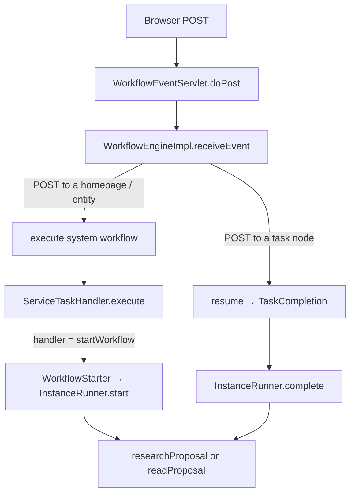
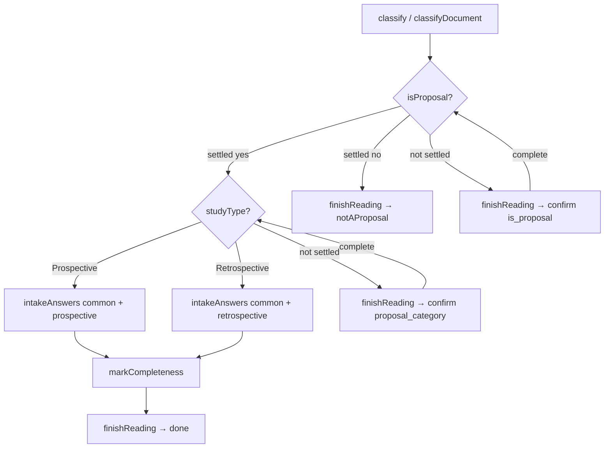

# Who calls whom during a research-proposal submission

Every POST into a submission goes through one door. After that the engine either runs a **system workflow** straight through (no instance, no wait) or **resumes / starts** a user workflow that can park on a user task and branch at a gateway.

The code below is trimmed to the lines that matter, so it does not match the files line for line.


```mermaid
flowchart TD
  UI["Browser POST"] --> Servlet["WorkflowEventServlet.doPost"]
  Servlet --> Engine["WorkflowEngineImpl.receiveEvent"]
  Engine -->|"POST to a task node"| Resume["resume → TaskCompletion"]
  Engine -->|"POST to a homepage / entity"| System["execute system workflow"]
  System --> Handler["ServiceTaskHandler.execute"]
  Handler -->|"handler = startWorkflow"| Starter["WorkflowStarter → InstanceRunner.start"]
  Resume --> Runner["InstanceRunner.complete"]
  Starter --> UserWF["researchProposal or readProposal"]
  Runner --> UserWF
```

---

## 0. The door: how a POST becomes an event

The UI never calls a handler. It POSTs a path. Sling routes that to `WorkflowEventServlet`.

`modules/workflows/src/main/java/io/uhndata/iap/workflows/internal/WorkflowEventServlet.java`:

```java
    @Override
    protected void doPost(final SlingJakartaHttpServletRequest request,
        final SlingJakartaHttpServletResponse response) throws IOException
    {
        try {
            final String name = eventName(request);
            final WorkflowResult result =
                this.engine.receiveEvent(request.getResource(), new WorkflowEvent(name, payload(request)));
```

The event name is decided here:

`modules/workflows/src/main/java/io/uhndata/iap/workflows/internal/WorkflowEventServlet.java`:

```java
    private String eventName(final SlingJakartaHttpServletRequest request)
    {
        final String named = request.getRequestPathInfo().getSelectorString();
        if (named != null && !named.isEmpty()) {
            return named;
        }
        final Resource target = request.getResource();
        if (target.isResourceType(TaskInstance.RESOURCE_TYPE)) {
            return TaskCompletion.COMPLETE_EVENT;
        }
        return target.isResourceType(SUBMISSION_RESOURCE_TYPE) ? SAVE_EVENT : CREATE_EVENT;
    }
```

| POST | Event | Why |
| --- | --- | --- |
| `POST /Submissions` | `create` | homepage, no selector |
| `POST /Submissions/.../abc` | `save` | a submission, no selector |
| `POST /Submissions/.../abc.attachDocument.json` | `attachDocument` | selector |
| `POST /Submissions/.../abc.extractAnswers.json` | `extractAnswers` | selector |
| `POST /Submissions/.../abc/wf:instances/.../task` | `complete` | a task node |

The engine then forks:

`modules/workflows/src/main/java/io/uhndata/iap/workflows/internal/WorkflowEngineImpl.java`:

```java
    public WorkflowResult receiveEvent(final Resource target, final WorkflowEvent event) throws WorkflowException
    {
        // ...
            if (privilegedTarget.isResourceType(TaskInstance.RESOURCE_TYPE)) {
                return resume(privilegedTarget, event, actor);
            }
            final StartEvent start = SystemWorkflowLocator.find(serviceResolver, target, event);
            PerformerCheck.verify(this.principals, serviceResolver, privilegedTarget, start, actor);
            return execute(privilegedTarget, event, start, actor);
```

- **Task node** → `resume` → `TaskCompletion.apply` → `InstanceRunner.complete`.
- **Anything else** → find a system workflow whose start `messageName` matches the event, then `execute` walks it node by node and dispatches each `handler` in `perform`.

`startWorkflow` is special-cased inside `perform` — it is the engine itself, not a registered handler:

`modules/workflows/src/main/java/io/uhndata/iap/workflows/internal/WorkflowEngineImpl.java`:

```java
    private void perform(final Activity activity, final WorkflowTaskContext context)
    {
        final String name = activity.getHandler();
        // ...
        if (WorkflowStarter.HANDLER_NAME.equals(name)) {
            WorkflowStarter.execute(context, performer(...), this.conditions, this.principals);
            return;
        }
        // else look up ServiceTaskHandler by name and call handler.execute(context)
```

---

## 1. Create the submission

**UI** `NewSubmissionDialog` POSTs title + schema version to `/Submissions`:

`modules/submissions/impl/src/main/frontend/src/NewSubmissionDialog.tsx`:

```tsx
  const submit = useCallback(() => {
    setSubmitting(true);
    setSubmitError(undefined);
    doFetch("/Submissions", {
      method: "POST",
      body: new URLSearchParams({ title: title.trim(), schemaVersion: selected }),
    })
```

That is `create`. The definition that answers it is `createSubmission`:

`modules/submissions/api/src/main/resources/SLING-INF/content/SystemWorkflows/createSubmission.json`:

```json
    "requested": { "messageName": "create", ... "targetRef": "create" },
    "create":           { "handler": "createSubmission" },
    "markCompleteness": { "handler": "markCompleteness" },
    "start":            { "handler": "startWorkflow", "workflowFrom": "schemaVersion/workflow" },
```

Straight-through walk:

1. **`createSubmission`** → `CreateSubmissionHandler` makes a `sub:Submission` under `/Submissions`, tags it `draft`, points it at the schema version, stores the new path as `CREATED_PATH`:

`modules/submissions/impl/src/main/java/io/uhndata/iap/submissions/internal/CreateSubmissionHandler.java`:

```java
    public void execute(final WorkflowTaskContext context) throws WorkflowException, PersistenceException
    {
        // ... title required ...
        final Resource created = context.getResourceResolver().create(bucketFor(context, name),
            name, Map.of("jcr:primaryType", "sub:Submission", TITLE, title, "tags", new String[] {DRAFT}));
        setSchemaVersion(created, version);
        context.setVariable(WorkflowResult.CREATED_PATH_VARIABLE, created.getPath());
    }
```

2. **`markCompleteness`** → `MarkCompletenessHandler` puts or removes the `incomplete` tag from required forms/documents the author still owes:

`modules/submissions/impl/src/main/java/io/uhndata/iap/submissions/internal/MarkCompletenessHandler.java`:

```java
    public void execute(final WorkflowTaskContext context) throws WorkflowException, PersistenceException
    {
        // ...
        if (!missing(submission).isEmpty()) {
            taggable.tag(INCOMPLETE, true);
        } else {
            taggable.untag(INCOMPLETE, true);
        }
    }
```

3. **`startWorkflow`** → `WorkflowStarter` follows `schemaVersion/workflow` (for the research-proposal demo that is `researchProposal`) and `InstanceRunner.start`s it on the new submission:

`modules/workflows/src/main/java/io/uhndata/iap/workflows/internal/WorkflowStarter.java`:

```java
        final Resource host = ExecutionHost.of(context);
        final Resource versionResource = follow(resolver, host, (String) chain);
        if (versionResource == null || !versionResource.isResourceType(WorkflowVersion.RESOURCE_TYPE)) {
            return;
        }
        // ...
        new InstanceRunner(...)
            .start(host, version);
```

The servlet then redirects the browser to that created path.

---

## 2. `researchProposal` parks on “Send for review”

The *New submission* dialog lists the top categories (`/Categories/Proposal`, `/Categories/PFQ`). Each
names the schema version its submissions answer, and that path is what the dialog POSTs.

`researchProposal` is a **user** workflow (it has an instance):

```
demos/research-proposal/src/main/resources/SLING-INF/content/Workflows/researchProposal.json
    "created"  → "complete" // user task, @creator: send for review
    "complete" → "review"
```

`InstanceRunner.start` walks from `created` and **stops at `complete`**. There is no upload step: uploading
is what starts the reading, in the `attachDocument` system workflow.

---

## 3. Attach a file → send it to Docling

**UI** `attachDocument`:

```ts
// modules/submissions/impl/src/main/frontend/src/submissionForm.ts
export async function attachDocument(path: string, requirement: string, file: File): Promise<void> {
  const body = new FormData();
  body.append("requirement", requirement);
  body.append("file", file);
  const response = await fetch(`${path}.attachDocument.json`, { method: "POST", body });
```

Event `attachDocument` → system workflow `attachDocument`:

```
modules/submissions/api/src/main/resources/SLING-INF/content/SystemWorkflows/attachDocument.json
    "requested" → "attach" // attachDocument: store the document
    "attach"    → "mark"   // markCompleteness
    "mark"      → "parse"  // parseDocuments, from the extraction module
```

**`attach`** — `AttachDocumentHandler` refuses (403/400) if the actor is not the creator, the submission is
not a draft, the MIME type is wrong, or the file is over 50 MB. Otherwise a document version is written.

**`parse`** — `ParseDocumentsHandler`:

```java
    public void execute(final WorkflowTaskContext context) throws PersistenceException
    {
        if (submission.getSchemaVersion().get(READING_WORKFLOW, String.class) == null) {
            return;   // a schema that reads nothing is left alone
        }
        for (final File file : SubmissionFiles.currentFiles(...)) {
            if (!isParseWanted(file)) { continue; }
            if (resource != null && queue(resource, file)) { queued++; }
        }
        if (queued > 0) {
            ExtractionStatus.record(target, ExtractionStatus.RUNNING, null);
            releaseReading(target);
        }
    }
```

**Branch in `isParseWanted`:** only files never parsed, or whose last parse **failed**, are sent. Already
queued or already read are left alone, so every upload can run this step.

`queue` stages the bytes on the shared volume and asks `ParseService` to enqueue a Sling job. The daemon is
not waited on.

Saving answers is the same pattern: `POST <submission>` (no selector) → event `save` → `SaveAnswersHandler`.

---

## 5. Daemon and callback (out of the workflow engine)

`ParseJobConsumer` takes the Sling job and POSTs `POST /parse?path=&job_id=` to Docling on :18765. The daemon answers “queued” immediately.

When Docling finishes it POSTs `/system/documents/parseCallback`. `ParseCallbackServlet` records the outcome; `ParseOutcomeDispatcher` hands it to whoever claims that file.

For a submission file that is `ParseCompletionHandler`:

`modules/extraction/src/main/java/io/uhndata/iap/extraction/internal/ParseCompletionHandler.java`:

```java
    public boolean handle(final ParseOutcome outcome)
    {
        // ...
            if (submission == null) {
                this.ingester.discardStaging(...);
                return true;   // file gone → drop the parse
            }
            this.engine.receiveEvent(submission, new WorkflowEvent(EVENT, payload(outcome)));
```

**Branch:** no submission left → discard staging and stop. Otherwise fire event `documentParsed` on the submission.

---

## 6. `documentParsed` → ingest + queue extraction

System workflow `documentParsed`:

`modules/extraction/src/main/resources/SLING-INF/content/SystemWorkflows/documentParsed.json`:

```json
    "parsed" → "ingest"   // ingestParse
    "ingest" → "queue"    // queueExtraction
    "queue"  → "done"
```

**`ingestParse`** — `IngestParseHandler`:

`modules/extraction/src/main/java/io/uhndata/iap/extraction/internal/IngestParseHandler.java`:

```java
        if (Boolean.TRUE.equals(event.get(ParseCompletionHandler.SUCCEEDED))) {
            ingest(file, event);   // Markdown + PDF + tokens onto the file
        } else {
            properties.put(..., STATUS_FAILED);
            properties.put(..., PARSE_ERROR, ...);
        }
```

**`queueExtraction`** always queues a Sling job, success or fail:

`modules/extraction/src/main/java/io/uhndata/iap/extraction/internal/QueueExtractionHandler.java`:

```java
        if (this.jobManager.addJob(ExtractAnswersJobConsumer.TOPIC,
            Map.of(ExtractAnswersJobConsumer.SUBMISSION, target.getPath())) == null) {
            throw new PersistenceException(...);
        }
```

---

## 7. Extraction job → start the reading workflow

`ExtractAnswersJobConsumer.process`:

`modules/extraction/src/main/java/io/uhndata/iap/extraction/internal/ExtractAnswersJobConsumer.java`:

```java
    private JobResult runReading(...)
    {
        if (submission == null) { return CANCEL; }
        if (!SubmissionFiles.allParsesSettled(...)) { return FAILED; }  // retry shortly
        if (!claimReading(...)) { return CANCEL; }                      // another job already owns it
        this.engine.receiveEvent(submission, new WorkflowEvent(EVENT, Map.of()));
        // EVENT is extractAnswers
    }
```

**Branches:**

| Condition | Job result | Meaning |
| --- | --- | --- |
| No path / submission gone | CANCEL | drop |
| A parse still unsettled | FAILED | Sling retries |
| Another job already claimed the reading | CANCEL | leave it |
| Engine throws | `giveUp` then rethrow | status failed, claim released so retry is possible |

A successful `extractAnswers` event runs this system workflow:

`modules/extraction/src/main/resources/SLING-INF/content/SystemWorkflows/extractAnswers.json`:

```json
    "requested": { "messageName": "extractAnswers" },
    "read": { "handler": "startWorkflow", "workflowFrom": "schemaVersion/readingWorkflow" },
```

`WorkflowStarter` follows `schemaVersion/readingWorkflow` → demo `readProposal`. That is a **second instance**, next to `researchProposal` which is still parked on “Send for review”.

The same event can be fired from the UI (`readAgain` → `POST <path>.extractAnswers.json` or `.retryParse.json`).

---

## 8. `readProposal` — classify, then read

`InstanceRunner.start` walks `readProposal` from `started`.

### 8a. `classify` → `ClassifyDocumentHandler`

A classification requirement (`sch:ClassificationRequirement`) is a form requirement with one question,
`decision`, whose options are the categories. It names the document requirement it classifies
(`document`), a `prompt`, an optional `template.md` reference, and a `confidenceThreshold`.

```
demos/research-proposal/src/main/resources/SLING-INF/content/Schemas/researchProposal.json
    "is_proposal":       document "proposal", options yes / no, template.md = the protocol structure
    "proposal_category": document "proposal", optionsFrom "/Categories/Proposal"
```

`classifyDocument` groups the classification requirements that apply and are not answered yet by the
document they point at, and makes **one call per document** with all their prompts and options. The
templates go into the system prompt as references.

| Condition | What is written | Status |
| --- | --- | --- |
| Every classification already answered | nothing | unchanged |
| Document not uploaded or still parsing | nothing | unchanged |
| Parse failed | nothing | **failed**, with why |
| Model unreadable / degraded | nothing | **failed** |
| Model answered | the picks, as pre-filled answers | unchanged |

A question the submitter already answered is never overwritten.

### 8b. Gateway `isProposal`

`FlowRouting.choose`: first arc whose condition holds, else the default. The conditions use the
`decision` source, which reads the answer to `is_proposal/decision` only once it is **settled**:

- confirmed or changed by the submitter, or typed by them, or
- picked by the model with a confidence at or above the requirement's `confidenceThreshold`.

An unsettled answer reads as no answer. Arcs:

- **Yes** (`equals yes`) → `studyType`.
- **No** (`equals no`) → `markCompleteness` → `finishReading` → end *Not a research proposal*.
- **Not settled** (default) → `markCompleteness` → `finishReading` (paused) → user task
  *Continue once this is confirmed* (`@creator`, `requirement=is_proposal`) → back to `isProposal`.

### 8c. Gateway `studyType`

Reads `proposal_category/decision` the same way:

- **Prospective** (includes any of the `/Categories/Proposal/Prospective` paths) → `askProspective`
  (`intakeAnswers`, requirement `[common, prospective]`).
- **Retrospective** → `askRetrospective` (requirement `[common, retrospective]`).
- **Not settled** (default) → pause on *Continue once the study type is confirmed*
  (`requirement=proposal_category`) → back to `studyType`.

`intakeAnswers` asks the questions of every requirement it names in one call, and writes only questions
that are still unanswered. Then `markCompleteness` → `finishReading` → `done`.


```mermaid
flowchart TD
  classify["classify / classifyDocument"] --> gate1{"isProposal?"}
  gate1 -->|"settled yes"| gate2{"studyType?"}
  gate1 -->|"settled no"| finNo["finishReading → notAProposal"]
  gate1 -->|"not settled"| pause1["finishReading → confirm is_proposal"]
  pause1 -->|"complete"| gate1
  gate2 -->|Prospective| askP["intakeAnswers common + prospective"]
  gate2 -->|Retrospective| askR["intakeAnswers common + retrospective"]
  gate2 -->|"not settled"| pause2["finishReading → confirm proposal_category"]
  pause2 -->|"complete"| gate2
  askP --> mark["markCompleteness"]
  askR --> mark
  mark --> fin["finishReading → done"]
```

`readPfq` is the same shape with one classification, `is_questionnaire`: settled yes reads the
`extracted` requirement out of the preamble and the questionnaire; settled no ends the reading.

---

## 9. Meanwhile / after: send for review

`researchProposal` is still on `complete` (“Send for review”). Completing that task (`completeTask` again) walks:

`complete` → `review` (user task, group `proposal-reviewers`, outcomes `approved` / `rejected`) → parks.

A reviewer POSTs to that task with `outcome`. `InstanceRunner.complete` records it. Then:

- `recordReview` writes the decision.
- Gateway `decision`: `variable outcome == approved` → end `approved`; default → end `rejected`.

`demos/research-proposal/src/main/resources/SLING-INF/content/Workflows/researchProposal.json`:

```json
      "toApproved": { "operandA": { "source": "variable", "value": ["outcome"] }, "value": ["approved"] }
      "toRejected": { "isDefault": true }
```

---

## Who calls whom, in one list

| Step | Caller | Callee | File |
| --- | --- | --- | --- |
| Any POST | Browser | `WorkflowEventServlet.doPost` | `WorkflowEventServlet.java` 102 |
| Name the event | servlet | `eventName` | same file 150 |
| Dispatch | servlet | `WorkflowEngineImpl.receiveEvent` | `WorkflowEngineImpl.java` 92 |
| Create | `execute` | `CreateSubmissionHandler` | `CreateSubmissionHandler.java` 85 |
| First completeness | `execute` | `MarkCompletenessHandler` | `MarkCompletenessHandler.java` 77 |
| Start process | `perform` | `WorkflowStarter` → `InstanceRunner.start` | `WorkflowStarter.java` 77, `InstanceRunner.java` 152 |
| Upload file | UI `attachDocument` | `AttachDocumentHandler`, then `ParseDocumentsHandler` | `submissionForm.ts`, `attachDocument.json` |
| Save answers | UI `POST path` | `SaveAnswersHandler` | `SaveAnswersHandler.java` 85 |
| Parse step | `attachDocument` | `ParseDocumentsHandler` → `ParseService.queue` | `ParseDocumentsHandler.java` |
| Daemon | `ParseJobConsumer` | Docling `POST /parse` | `ParseJobConsumer.java` |
| Callback | daemon | `ParseCallbackServlet` → `ParseCompletionHandler` | `ParseCallbackServlet.java` 110, `ParseCompletionHandler.java` 99 |
| Ingest | engine `documentParsed` | `IngestParseHandler` then `QueueExtractionHandler` | `IngestParseHandler.java` 60, `QueueExtractionHandler.java` 64 |
| Read answers | Sling job | `ExtractAnswersJobConsumer` → event `extractAnswers` | `ExtractAnswersJobConsumer.java` 76 |
| Start reading | `startWorkflow` | `readProposal` instance | `extractAnswers.json` 24 |
| Classify | instance | `ClassifyDocumentHandler` | `ClassifyDocumentHandler.java` |
| Settled? | gateway | `DecisionOperandResolver` | `DecisionOperandResolver.java` |
| LLM | instance | `IntakeAnswersHandler` | `IntakeAnswersHandler.java` |
| Branch | instance | `FlowRouting.choose` | `FlowRouting.java` 274 |
| Stop spinner | instance | `FinishReadingHandler` | `FinishReadingHandler.java` 52 |
| Review | `completeTask` | `recordReview` then `decision` gateway | `researchProposal.json` 88 |

Two instances live on the same submission at once after a successful parse: **`researchProposal`** (human: send → review) and **`readProposal`** (machine, then maybe a pause to confirm a classification). They only share the submission node and its answers. Completing one never advances the other.
