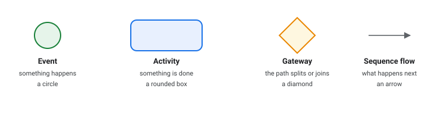
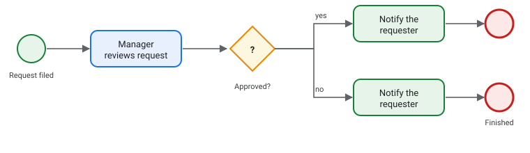
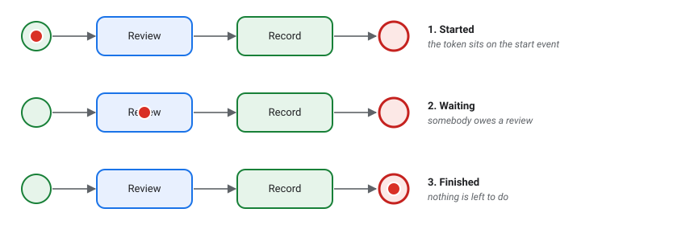
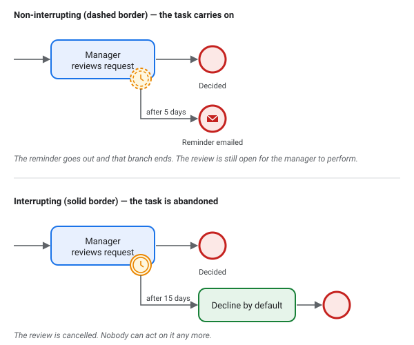
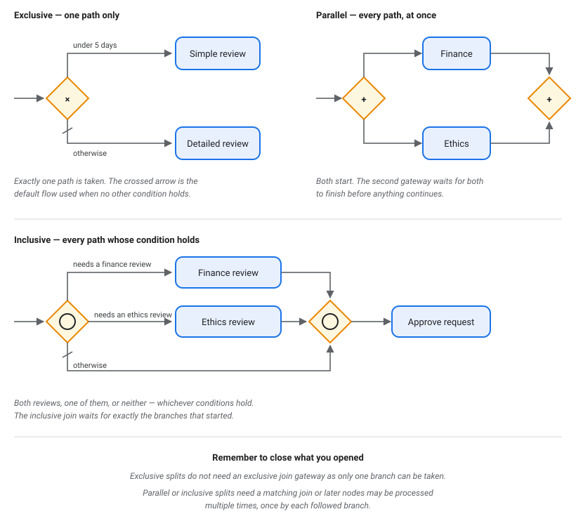
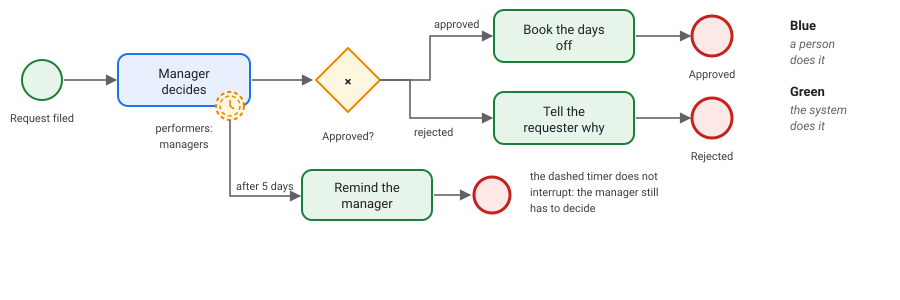

# A primer on workflows and BPMN

You already know how your institution's processes work: who fills in what, who has to
sign off, what happens when somebody objects, how long people are given. This page is
about writing that down in a form the platform can actually run — as a **diagram**, not
as code.

No programming is involved. If you can draw your process on a whiteboard, you can draw it
in the editor. What follows is the vocabulary, and enough of the rules to keep you out of
the usual traps.

## What a workflow is

A **workflow** is your process, written down precisely enough that the platform can carry
it out: who has to look at something, in what order, what people are allowed to do at
each point, and when it is finished.

Two words that come up constantly, and are easy to mix up:

- A **workflow** — sometimes a *workflow definition* — is the process itself, the diagram
  you draw. One per kind of thing: "how a leave request is handled".
- A **workflow instance** is one particular run of it. Priya's leave request from
  Tuesday. Hundreds of instances of one workflow can be in flight at once, each at its own
  point in the diagram.

Think of the workflow as the recipe and the instance as tonight's dinner.

## BPMN, and why a standard

The diagrams follow **BPMN** — Business Process Model and Notation — an international
standard for drawing processes. It is not something this platform invented: a BPMN
diagram means the same thing to a colleague at another institution, to a consultant, to a
textbook, and to the software.

You do not need to learn all of it. Four shapes will carry almost everything you draw.

## The four shapes

- An **event** — a circle — is something that happens. A request arrives; a deadline
  passes; the process finishes.
- An **activity** — a rounded box — is something that gets done. Usually called a
  **task**.
- A **gateway** — a diamond — is where the path splits or comes back together. A decision
  point.
- A **sequence flow** — an arrow — is what happens next.

Put together, they read left to right like a sentence:

## Following the path: the token

When a process starts, imagine a marker being placed on the start event. It moves along
the arrows as things happen, and it stops wherever the process is waiting for somebody.
That marker is called a **token**, and it is the single most useful idea for reading a
diagram.

Where the token sits *is* the state of that request. If it is resting on "Review", then
somebody owes a review and nothing else will happen until they give one. When the token
reaches an end event, that run is over.

This is also how the platform answers "what is waiting on me?" — it looks for tokens
resting on tasks you are allowed to act on.

## Events: how things start, pause, and finish

**Start event** (thin circle). Where a run begins. Every workflow needs one.

**End event** (thick circle). Where a run finishes. You may have several — "approved" and
"rejected" are perfectly good separate endings, and it is usually clearer than forcing
both into one.

**Intermediate event** (double circle). Something that happens in the middle. The most
useful kind is a **timer**, drawn with a small clock, and the most useful place to put one
is on the *edge* of a task:

An event sitting on the edge of a task is a **boundary event**. It watches for as long as
that task is open. This is how you say "give them five days, then send a reminder"
without anyone having to remember to check.

Look at the border, because it changes the meaning entirely. A **solid** border
*interrupts*: the task is abandoned and the flow leaving the timer is taken instead — a
deadline. A **dashed** border does *not*: the side branch runs while the task stays open,
which is what a reminder is. Drawing a reminder with a solid border quietly cancels the
work you were following up on.

## Activities: who or what does the work

Two kinds matter.

A **user task** is work a person does — reviewing, approving, filling something in. The
process stops here and waits. This is where most of your diagram's meaning lives.

A **service task** is work the platform does by itself — sending a notification, filing a
record, updating a status. It takes no time from anyone's day and the process carries
straight on through it.

The distinction matters because **only user tasks make the process wait**. If your diagram
seems to finish instantly, it is probably all service tasks and you have not said where a
human is needed.

## Gateways: splitting and rejoining

An **exclusive gateway** (a diamond marked ×) is a fork in the road. Exactly one path is
taken, based on a condition — "was it approved?", "is it more than five days?". Label
every outgoing arrow with the condition that chooses it, and make sure the conditions
cover every case. A request that matches none of them is stuck.

A **parallel gateway** (a diamond marked +) sends the process down *every* path at once.
Use it when two reviews can happen independently and neither should wait for the other.

The rule people forget: **a parallel split needs a matching parallel join.** The second
diamond waits until every branch has arrived, then lets one token continue. Without it,
the rest of your process happens twice. An exclusive split needs no join, because only
one path was ever taken.

## Who is allowed to act

A task is not finished when somebody clicks a button; it is finished when somebody *who is
allowed to* clicks it. In the editor, each task carries a list of **performers** — the
groups or people who may act on it.

Two things worth knowing before you draw:

- **An empty list means nobody.** Leaving performers blank does not mean "anyone" — the
  task will refuse everybody until you say who. That is deliberate: a process that has
  forgotten to say who approves should stop, not let everyone approve.
- **Name groups, not people.** "Department managers" survives somebody leaving; "Sam
  Okafor" does not.

## A worked example

Here is the whole vocabulary in one diagram — the time-off request that ships with the
platform as a demonstration:

Read it as: a request is filed. A manager has to decide, and only managers can. If five
days pass without a decision, the dashed timer fires, the manager is reminded, and that
little branch finishes on its own — the request is still sitting with the manager. Once
the decision comes, the path splits: approved requests get booked, rejected ones get an
explanation. Either way the run ends.

Notice how much of the process is in the *labels*, not the shapes. "After 5 days",
"approved", "performers: managers" — the shapes give the skeleton, and the labels are
where your institution's actual rules live.

## Versions: why you cannot just edit a running process

Workflows are **versioned**. When you change a process, you are making a new version,
and the old one keeps running.

This matters more than it sounds. Requests already in flight continue under the rules
that applied when they started — which is usually what fairness requires, and always what
an auditor asks about. Somebody whose request was filed in March is judged by March's
process, even if you changed it in April.

The practical consequence: **do not expect an edit to affect requests already underway.**
If a change has to apply to them, that is a conversation to have before you make it.

## Getting started in the editor

1. **Sketch it on paper first**, in plain words. Who does what, in what order, what can
   go wrong. The editor is for writing it down, not for working it out.
2. **Start with the happy path.** Start event, the tasks in order, end event, all in a
   straight line. Get that right before adding any branches.
3. **Add the decisions.** Where the path forks, put an exclusive gateway and label both
   arrows with the conditions.
4. **Say who may act.** Go through every user task and set its performers. This is the
   step most often skipped, and a task with nobody named will not work.
5. **Add the time limits last.** Boundary timers on the tasks where waiting forever is a
   real risk.
6. **Read it back aloud**, following the arrows. If you cannot narrate it as a sentence,
   neither can anybody else.

## Common mistakes

| Mistake | What happens |
| --- | --- |
| No performers on a user task | Nobody can complete it; the request stops there for good |
| Conditions on a fork that miss a case | A request matching none of them gets stuck |
| A parallel split with no join | Everything after it happens twice |
| Naming individuals as performers | The process breaks when they change roles or leave |
| Everything a service task | The process runs to the end instantly, asking nobody |
| No timer anywhere | One unread email stalls a request indefinitely |
| A reminder drawn with a solid border | The task is cancelled instead of nudged along |

## Glossary

| Term | Meaning |
| --- | --- |
| **BPMN** | Business Process Model and Notation — the standard these diagrams follow |
| **Workflow** (definition) | The process itself, as drawn |
| **Version** | One issue of a workflow. Runs that started under it keep following it |
| **Instance** | One particular run — one person's request |
| **Token** | The marker showing where a run has got to |
| **Event** | A circle. Something that happens: a start, an end, a deadline |
| **Boundary event** | An event on the edge of a task, watching while the task is open. Solid border: it interrupts the task. Dashed: it does not |
| **Activity / task** | A rounded box. Something that gets done |
| **User task** | A task a person does. The process waits |
| **Service task** | A task the platform does. The process carries on |
| **Gateway** | A diamond. The path splits or rejoins |
| **Exclusive gateway** (×) | One path only, chosen by a condition |
| **Parallel gateway** (+) | Every path, at once — and a matching one to rejoin them |
| **Sequence flow** | An arrow. What happens next |
| **Performers** | Who is allowed to act on a task |

## Where to go next

This page covers what you need to read and draw a process. If you want to know how the
platform stores and runs what you have drawn — the node types, the engine, the parts a
developer works with — that is in [workflows.md](workflows.md).
