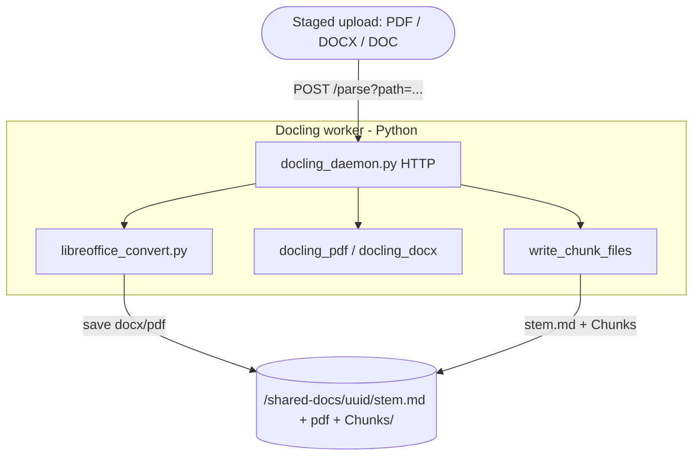
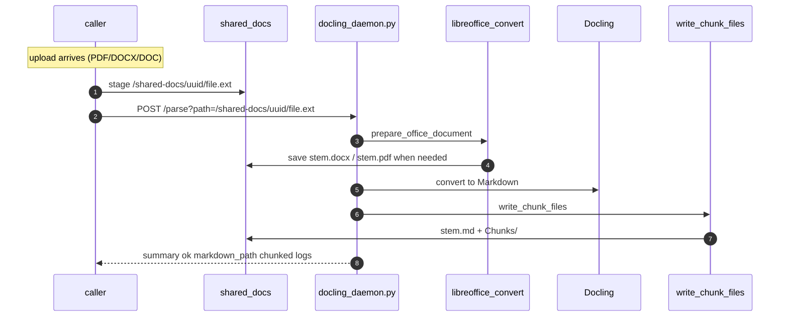
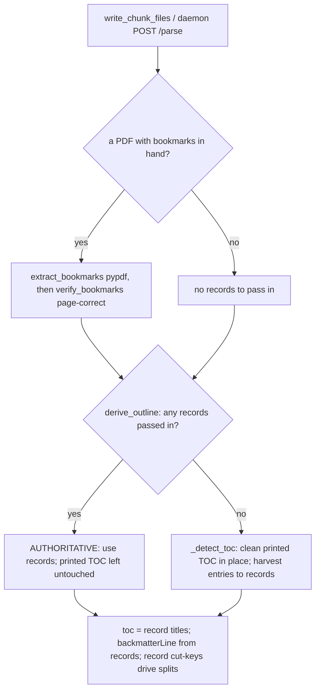

# Parsing Pipeline — How an upload becomes Markdown + chunks

A file (PDF / DOCX / DOC) is turned into one `<stem>.md` plus a `Chunks/` tree
(`outline.json`, and when the document is large enough `catalog.json` + `Chunk-*.md`).
Everything runs in Python: LibreOffice prep, Docling conversion, and all derived-file writes.

- **Source**: `modules/documents/processing/src/main/python/`

The file to parse must already be on the shared volume (`IAP_SHARED_DOCS`, `/shared-docs` in
the image). The caller stages it there and passes its **path**; the daemon never receives
document bytes.

---

## Big picture — who calls what



**Path-based round trip:** the caller stages the upload under `/shared-docs/{uuid}/`, then
`POST /parse?path=...`. Python runs LibreOffice (DOC/DOCX), Docling, and `write_chunk_files`
(the sole writer of `{stem}.md` + `Chunks/`). The HTTP reply is a small summary only.

---

## The daemon flow, step by step



**There is no fallback processor.** Docling (daemon or CLI) is the only one. If Docling fails,
the parse fails.

### The `/parse` request

```
POST /parse?path=/shared-docs/.../file.pdf&chunk=true&max_tokens=2000&min_structure_tokens=20000
```

`path` is required and is resolved against `IAP_SHARED_DOCS` (`resolve_parse_path`); the
request body is ignored. `chunk` defaults to true; `max_tokens` and `min_structure_tokens`
default to the constants below. The daemon also serves `GET /health` and `POST /shutdown`.

---

## Components

| Module | Role |
|---|---|
| `docling_daemon.py` | **`POST /parse?path=...`** under `IAP_SHARED_DOCS`, `GET /health`, `POST /shutdown` |
| `parse_document.py` | Shared orchestrator: LibreOffice prep → Docling → `write_chunk_files` |
| `libreoffice_convert.py` | DOC→DOCX+PDF, DOCX→PDF; saves beside source immediately |
| `docling_parser.py` | CLI entry via `parse_document` |
| `docling_pdf_parser.py` | `convert_pdf_to_markdown` — page-sharded parallel Docling |
| `docling_docx_parser.py` | DOCX → Markdown (Docling; no page markers) |
| `docling_batch_sizing.py` | Worker-count / page-batch sizing from RAM + cores |
| `docling_config.py` / `docling_error_detection.py` | Shared Docling pipeline options; parse-failure detection |
| `markdown_cleanup.py` | `clean_markdown` — strip garbage lines, collapse blanks (idempotent). Called **once per document**, by the converter only |
| **`chunker.py`** | `write_chunk_files` — **sole** writer of `{stem}.md` + `Chunks/`; `build_chunk_tree` is in-memory only |
| `toc_and_appendix_detection.py` | `derive_outline` — the outline **fork**, pure and the only entry point |
| `bookmarks.py` / `pdf_bookmarks.py` | Outline-record helpers / PDF bookmark extraction |
| `heading_numbering.py` | Section-numbering depth for heading levels |

---

## Markdown generation

- **PDF (Docling)** — `convert_pdf_to_markdown` reads the page count with `pypdf`,
  splits the pages into batches, and converts each batch in a **separate worker process**
  (`ProcessPoolExecutor`), exporting Markdown **per page** with a `<!-- page: N -->` marker
  before each. Fragments are concatenated in page order. (This per-page-range sharding is why
  bookmark/outline inference cannot run inside Docling — no single process sees the whole
  document; it runs later, in the chunker, over the assembled `.md` + sibling PDF.)
- **DOCX** — LibreOffice writes `{stem}.pdf`, then Docling converts the DOCX. No physical pages
  ⇒ no `<!-- page: N -->` markers (so `evidence.page` is null downstream).
- **DOC** — LibreOffice writes `{stem}.docx` and `{stem}.pdf`, then Docling converts the DOCX.

Every path ends the same way: `write_chunk_files` writes `<answerDir>/<stem>.md` and
`Chunks/` beside the staged source under `/shared-docs`.

---

## Chunking (`chunker.py`)

Pure regex/string work over the already-produced Markdown — **no LLM, no ML tokenizer, no
Docling re-convert** (milliseconds). Token counts are the cheap `len(text) // 4`.

The chunker does **not** clean. `clean_markdown` runs exactly once per document, in the
converter that produced the `.md`, and everything below takes that text as-is.

```
chunk_file(<stem>.md)                                        # md is already cleaned
  └─ write_chunk_files(md, output_file)
       ├─ verify_bookmarks(extract_bookmarks(...))(<stem>.pdf, md)  # sibling PDF bookmarks, pages verified
       └─ build_chunk_tree(md, filename, records) # pure: no filesystem, returns the whole tree
            ├─ derive_outline(md, records)        # fork → toc, backmatterLine, tokens, source
            │
            ├─ size gate:  tokens = len(md)//4  vs  DEFAULT_MIN_STRUCTURE_TOKENS (20000)
            │    ├─ below → outline only {chunked:false}; STOP (whole-doc used downstream)
            │    └─ at/above ↓
            │
            ├─ split main content at the shallowest ATX heading level
            ├─ unite consecutive sections up to DEFAULT_MAX_TOKENS (2000)
            ├─ over-budget piece → _split_oversized → _subchunk_blocks, in order:
            │       ATX sub-heading → outline-record cut → numbered stand-out → paragraph
            ├─ small text-only tail (< MIN_TAIL_TOKENS 500) folded into the previous part
            └─ backmatterLine..EOF → one standalone backmatter chunk (no sub-splitting)
       │
       └─ write Chunks/ : Chunk-*.md, catalog.json, outline.json,
                          bookmarks.json (the resolved records, when there are any)
```

Disk writing lives in `write_chunk_files` (analysis in `build_chunk_tree`). The only caller
of `write_chunk_files` is `chunk_file`:

- `parse_document(...)` — daemon / `docling_parser.py` CLI: LibreOffice → Docling → write `.md`
  → `chunk_file`.
- `python chunker.py <file>` — re-chunk an already-parsed `.md` via `chunk_file` alone.

---

## The outline subsystem

The document **outline** is a list of records `{title, level|null, page|null, verified?}`,
held in memory for the whole run and folded into `Chunks/outline.json`. It drives three
things: the `toc` array, `backmatterLine`, and record-based sub-chunk cut points. Records
come from one of two sources, decided by a **fork** in `derive_outline`:

The CLI also drops the resolved records into `Chunks/bookmarks.json` so a run can be
inspected. Nothing reads that file back — records are always re-derived — which is what keeps
a stale copy from being mistaken for authoritative bookmarks on a later run.



The producer is recorded as **`toc_source`** in `outline.json` — `pdf-bookmarks`,
`md-toc`, or `none` — and echoed in the chunk logs (`chunk_file` → `toc_source=…`),
so you can tell after the fact (or live) which path produced a document's `bookmarks.json`.

Key behaviours:

- **Verification / page-correction** (`bookmarks.verify_bookmarks`) — a bookmark often points
  one page early (header at the top of the next page). For each record the title is looked up
  on its claimed page, then N−1 and N+1; found on a neighbour ⇒ the page is **rewritten**;
  found nowhere ⇒ `verified: false`. Unpaged documents (DOCX) skip this.
- **Manual harvest** (`_entry_to_record`) — a printed-TOC entry becomes a record: title (page
  stripped), page (its trailing number), level (numbering depth via `heading_numbering`).
- **Record → line resolution** (`resolve_record_line`) — a record maps to a body line only if
  its title (normalized: casefold + alphanumerics) matches **exactly one** eligible line;
  when its page is trusted, only lines on **exactly that page** count. Fail-open: 0 or >1
  matches resolve to nothing rather than the wrong line.
- **Record cut points** (`_record_cut_keys`) — records that resolve uniquely to a non-ATX,
  non-TOC-range body line become sub-chunk boundaries — recovering section headings Docling
  emitted as plain/bold text instead of `#`.

The source PDF reaches the chunker as a sibling of the `.md`: either the native upload staged
beside it, or the `{stem}.pdf` rendition LibreOffice wrote during `prepare_office_document`.

---

## On-disk artifacts (per answer)

```
<answerDir>/
    <stem>.md                 # the parsed Markdown (written by write_chunk_files)
    <stem>.pdf                # co-located source / rendition (for the bookmark outline)
    bookmarks.json            # outline records (regenerated on reconvert)
    Chunks/
        outline.json          # ALWAYS written: fileId, tokens, chunked, toc_source, toc (+ unchunkedReason when below the gate)
        catalog.json          # only when chunked: one slim entry per Chunk-*.md
        Chunk-0.md            # content before the first boundary heading (if any)
        Chunk-1.md
        Chunk-2.1.md          # an oversized chunk split into parts
        Chunk-2.2.md
```

`clear_prior_outputs(output_file)` deletes sibling `outline.json` / `bookmarks.json` and the
whole `Chunks/` tree. `write_chunk_files` always replaces `Chunks/`; `parse_document` with
`chunk=false` writes the `.md` and then calls `clear_prior_outputs` so a prior run's chunks
cannot linger. Staleness is handled by **wipe-and-redo**, not versioning.

---

## Run modes

| | Daemon | CLI / inline |
|---|---|---|
| Convert + chunk | Caller stages path under `/shared-docs`, `POST /parse?path=…` → `parse_document` → `write_chunk_files` | `docling_parser.py <file>` same path, or `python chunker.py <file>` re-chunks an existing `.md` |
| Files owned by | Python on the shared volume | Python (writes `.md` + `Chunks/` itself) |
| Source PDF for outline | Sibling `<stem>.pdf` beside the staged file (native or LibreOffice) | same, when a sibling `<stem>.pdf` exists |

Both modes share `chunker.py`, so the outline + chunk logic is identical.

---

## Key constants

| Constant | Value | Meaning |
|---|---|---|
| `DEFAULT_MIN_STRUCTURE_TOKENS` | 20000 | Size gate: below this the doc is left unchunked (whole-document downstream) |
| `DEFAULT_MAX_TOKENS` | 2000 | Target max tokens per chunk file before an over-budget piece is split |
| `MIN_TAIL_TOKENS` | 500 | A text-only tail smaller than this is folded back into the previous part |
| `MAX_HEADING_WORDS` / `MAX_WORD_CHARS` / `MIN_HEADING_CHARS` | 10 / 100 / 5 | Heading-validity filters (reject run-ons, garbage, `Table …` captions) |
| `DEFAULT_PORT` | 18765 | Daemon HTTP port |
