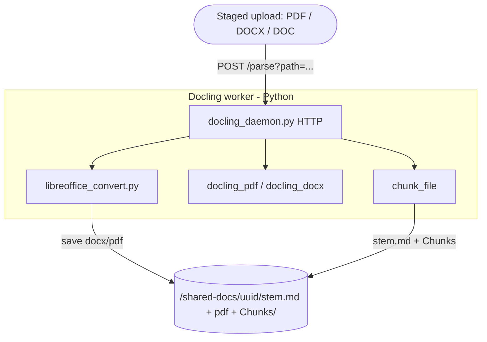
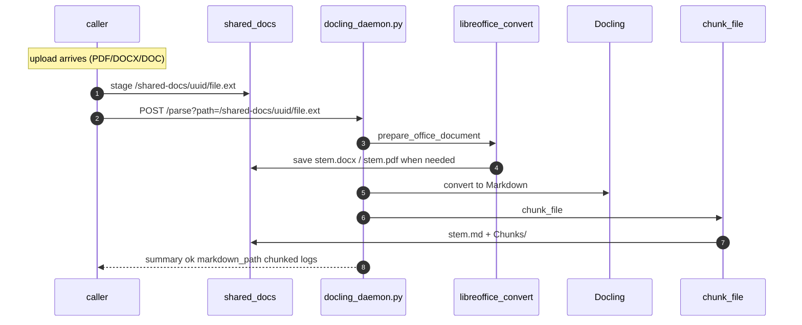
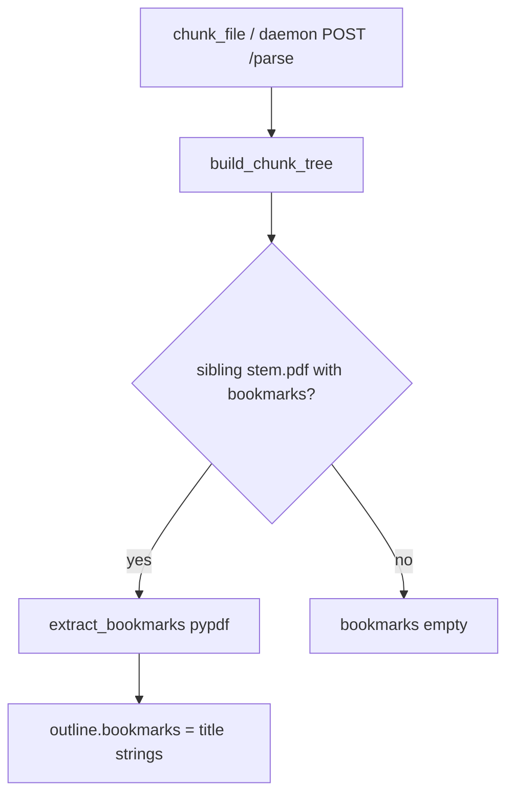

# Parsing Pipeline — How an upload becomes Markdown + chunks

A file (PDF / DOCX / DOC) is turned into one `<stem>.md` plus a `Chunks/` tree
(`outline.json`, and when the document is large enough `catalog.json` + `Chunk-*.md`).
Everything runs in Python: LibreOffice prep, Docling conversion, and all derived-file writes.

- **Source**: `modules/documents/processing/src/main/python/`

The file to parse must already be on the shared volume (`IAP_SHARED_DOCS`, `/shared-docs` in
the image). The caller stages it there and passes its **path**; the daemon never receives
document bytes.

---

## Big picture — who calls what



**Path-based round trip:** the caller stages the upload under `/shared-docs/{uuid}/`, then
`POST /parse?path=...`. Python runs LibreOffice (DOC/DOCX), Docling, and `chunk_file`
(the sole writer of `{stem}.md` + `Chunks/`). The HTTP reply is a small summary only.

---

## The daemon flow, step by step



**There is no fallback processor.** Docling (daemon or CLI) is the only one. If Docling fails,
the parse fails.

### The `/parse` request

```
POST /parse?path=/shared-docs/.../file.pdf&chunk=true&max_tokens=2000&min_structure_tokens=20000
```

`path` is required and is resolved against `IAP_SHARED_DOCS` (`resolve_parse_path`); the
request body is ignored. `chunk` defaults to true; `max_tokens` and `min_structure_tokens`
default to the constants below. The daemon also serves `GET /health`, and `POST /shutdown`
when started with `--enable-shutdown`.

`/parse` and `/shutdown` change state, so both refuse any request carrying an `Origin`
header — nothing that legitimately drives the daemon is a web page, and loopback binding is
no defence when the browser runs on the same host. Setting `IAP_DOCLING_TOKEN` additionally
requires it as a bearer token on those two endpoints. `GET /health` stays open so container
probes need no credential.

One conversion runs at a time (`MAX_CONCURRENT_PARSES`), because the whole RAM budget is
calculated for a single conversion spread across the worker pool. A request arriving while
one is running is refused with `503 {"error": "daemon busy: …"}` rather than queued — a
conversion takes minutes, and holding the socket open for one that has not started only
invites client timeouts. Callers retry.

---

## Components

| Module | Role |
|---|---|
| `docling_daemon.py` | **`POST /parse?path=...`** under `IAP_SHARED_DOCS`, `GET /health`, `POST /shutdown` |
| `parse_document.py` | Shared orchestrator: LibreOffice prep → Docling → `chunk_file` |
| `libreoffice_convert.py` | DOC→DOCX+PDF, DOCX→PDF; saves beside source immediately |
| `docling_parser.py` | CLI entry via `parse_document` |
| `docling_pdf_parser.py` | `convert_pdf_to_markdown` — page-sharded parallel Docling |
| `docling_docx_parser.py` | DOCX → Markdown (Docling; no page markers) |
| `docling_batch_sizing.py` | Worker-count / page-batch sizing from RAM + cores |
| `docling_config.py` / `docling_error_detection.py` | Shared Docling pipeline options; parse-failure detection |
| `markdown_cleanup.py` | `clean_markdown` — strip garbage lines, collapse blanks (idempotent). Called **once per document**, by the converter only |
| **`chunker.py`** | `chunk_file` — **sole** writer of `{stem}.md` + `Chunks/`; `build_chunk_tree` is in-memory only. Leaf splitting is [chunkweaver](https://github.com/metawake/chunkweaver) |
| `heading_helpers.py` | Identify ATX headings, match them to PDF bookmarks |
| `pdf_bookmarks.py` | PDF bookmark extraction (pypdf) |

---

## Markdown generation

- **PDF (Docling)** — `convert_pdf_to_markdown` reads the page count with `pypdf`,
  splits the pages into batches, and converts each batch in a **separate worker process**
  (`ProcessPoolExecutor`), exporting Markdown **per page** with a `<!-- page: N -->` marker
  before each. Fragments are concatenated in page order. (This per-page-range sharding is why
  bookmark/outline inference cannot run inside Docling — no single process sees the whole
  document; it runs later, in the chunker, over the assembled `.md` + sibling PDF.)
- **DOCX** — LibreOffice writes `{stem}.pdf`, then Docling converts the DOCX. No physical pages
  ⇒ no `<!-- page: N -->` markers (so `evidence.page` is null downstream).
- **DOC** — LibreOffice writes `{stem}.docx` and `{stem}.pdf`, then Docling converts the DOCX.

Every path ends the same way: `chunk_file` writes `<answerDir>/<stem>.md` and
`Chunks/` beside the staged source under `/shared-docs`.

---

## Chunking (`chunker.py`)

Pure regex/string work over the already-produced Markdown — **no LLM, no ML tokenizer, no
Docling re-convert** (milliseconds). Token counts are the cheap `len(text) // 4`.

The chunker does **not** clean. `clean_markdown` runs exactly once per document, in the
converter that produced the `.md`, and everything below takes that text as-is.

```
chunk_file(<stem>.md)                                        # md is already cleaned
  └─ build_chunk_tree(md, markdown_path, max_tokens, min_structure_tokens)
       │                                     # pure: no writes, returns the whole tree
       ├─ extract_bookmarks(<stem>.pdf)  # sibling PDF; titles taken as given
       │                                  # → outline.bookmarks, tokens
       │                                  # no bookmarks → bookmarks []
       │
       ├─ size gate:  tokens = len(md)//4  vs  DEFAULT_MIN_STRUCTURE_TOKENS (20000)
       │    ├─ below → outline only {chunked:false}; STOP (whole-doc used downstream)
       │    └─ at/above ↓
       │
       ├─ if bookmarks: rewrite heading lines to bookmark level/title
       ├─ _split_into_chunks: one chunkweaver pass to DEFAULT_MAX_TOKENS (2000) --
       │       top heading level always, deeper levels where over budget, then paragraphs,
       │       then sentences
       └─ small text-only tail (< MIN_TAIL_TOKENS 500) folded into the previous part
  │
  └─ write Chunks/ : Chunk-*.md, catalog.json, outline.json
```

Disk writing lives in `chunk_file` (analysis in `build_chunk_tree`). Callers:

- `parse_document(...)` — daemon / `docling_parser.py` CLI: LibreOffice → Docling → `chunk_file` with the Markdown already in hand.
- `python chunker.py <file>` — re-chunk an already-parsed `.md`.

There is one `Chunks/` per folder, and writing it replaces whatever is there. That is safe
because the caller owns the directory's lifecycle: each upload is staged under
`/shared-docs/{uuid}/` on its own, and once a parse finishes the caller reads the outputs out
and wipes the directory. **No parse ever meets files left by an earlier one**, so nothing here
checks for them — see "Staleness" below.

---

### What chunkweaver does, and what it does not

All the cutting happens in **one** `Chunker` call, in `_split_into_chunks`. It gets the real
budget, so the strongest heading level always cuts, deeper levels cut only where a section is
over budget, and a section too big for its own sub-headings falls through to paragraphs and
then sentences. That last fallback is why the library is here at all: Docling emits a table as
a run of `|` lines with no blank line, so a 700-row schedule of assessments is a single
paragraph, and the hand-written splitter returned it whole -- one chunk 6.4x over budget.

It cuts on the heading lines, which the bookmark rewrite has already set to the bookmark
levels, so cutting on them is cutting on the outline -- and a heading the outline missed still
starts a chunk, which cutting only at bookmark-matched lines did not do.

Two settings are not optional. `overlap=0`, because the default is 2 sentences of RAG
retrieval overlap, which repeats text across chunk files and inflated a test document by 43%.
And `min_size` has to stay under `target_size`: it wins when the two disagree, so a floor
above the budget puts every part over budget.

`MARKDOWN_LEVELED` is used without its `^---` spec (see `HEADING_BOUNDARIES`). Docling emits
horizontal rules inside sections, and cutting on them opens a chunk with a bare rule.

What it does **not** do:

- **The post-cut pass**: trailing page markers moved to the next chunk, small text tails
  folded back, pageStart/pageEnd in the catalog.

## The outline subsystem

The document **outline** is PDF bookmark **titles** (strings) from
``extract_bookmarks``, held in memory with level/page for heading rewrite and written to
`Chunks/outline.json` as ``bookmarks: ["…", …]``. They come from a sibling PDF,
and from nothing else. A document with no PDF bookmarks reports an empty `bookmarks` list.



Key behaviours:

- **Heading-level ceiling** — `bookmarks` keeps entries at level 1–`MAX_HEADING_LEVEL` (6). Deeper nesting is still walked (up to `MAX_OUTLINE_DEPTH`) so a crafted outline cannot exhaust the stack.
- **Bookmark levels drive chunking** — when bookmarks exist, each Markdown heading line is matched to a PDF bookmark by normalized title only (dest page is ignored). The line is rewritten to that bookmark's level and title before any split, so a `###` that the bookmarks call level 1 is cut as `#`.
- **Catalog heading** — each chunk's `heading` is the text of its first non-neutral line when that line is ATX; otherwise empty. Bookmarks rewrite heading lines in the Markdown before splitting.
- **No page rewrite** — a bookmark's page used to be looked up in the `<!-- page: N -->`
  markers and corrected when it pointed one page early. Matching is by title only; the titles
  are taken as the PDF gives them.
- **Sub-chunk boundaries** — chunkweaver cuts on any ATX sub-heading (after the bookmark rewrite, when an outline exists), then paragraphs, then sentences. Bold/ALL-CAPS lines are not cuts on their own.

The source PDF reaches the chunker as a sibling of the `.md`: either the native upload staged
beside it, or the `{stem}.pdf` rendition LibreOffice wrote during `prepare_office_document`.

---

## On-disk artifacts (per answer)

```
<answerDir>/
    <stem>.md                 # the parsed Markdown (written by chunk_file)
    <stem>.pdf                # the staged source, or the LibreOffice rendition, which is
                              # written unconditionally -- nothing checks the name first
    Chunks/
        outline.json          # ALWAYS written: tokens, chunked, bookmarks (+ unchunkedReason whenever chunked is false)
        catalog.json          # only when chunked: one slim entry per Chunk-*.md
        Chunk-0.md            # content before the first heading (if any)
        Chunk-1.md
        Chunk-2.md
```

``extract_bookmarks`` reaches disk as title strings in ``bookmarks`` in `Chunks/outline.json`.

### Staleness

There is none to handle. A parse starts from a directory holding one staged upload and nothing
else: the caller reads every output into its own storage as soon as the parse finishes, then
wipes the directory. So this code neither defends against a previous parse's leftovers nor
cleans them up — it only ever writes its own outputs, and `chunk_file` replaces
`Chunks/` wholesale when the `chunk_file` CLI re-chunks a document in place.

`parse_document` with `chunk=false` writes `Chunks/outline.json` with
`unchunkedReason: chunking_not_requested` **and then** the `.md`, in that order — the `.md` is
the commit marker, so writing it first would leave Markdown with no outline beside it. Both
unchunked paths leave the same shape on disk.

**Publication is all-or-nothing.** The chunk tree is written into `Chunks.new-<pid>/` and
moved into place with a rename, and the `.md` goes through a temporary file of its own — so a
crash, a full disk or a kill can never leave a half-written chunk set that looks finished.
The chunks are swapped in *before* the Markdown, which makes the `.md` the commit marker: a
new `.md` guarantees the chunks beside it are the matching new set. Nothing locks the
directory, because nothing else is writing to it: one parse owns one `/shared-docs/{uuid}/`,
and the daemon runs one conversion at a time.

### LibreOffice renditions

`prepare_office_document` writes `{stem}.docx` (for a `.doc`) and a best-effort `{stem}.pdf`
beside the source, and `build_chunk_tree` picks the PDF up as the `.md`'s sibling. That works
because a parse owns its directory: the only `{stem}.pdf` there is the one this run rendered,
or the staged PDF itself when the upload was already a PDF.

`convert()` requires the expected file to exist afterwards, because `soffice` exits 0 having
converted nothing often enough to be worth checking.

---

## Run modes

| | Daemon | CLI / inline |
|---|---|---|
| Convert + chunk | Caller stages path under `/shared-docs`, `POST /parse?path=…` → `parse_document` → `chunk_file` | `docling_parser.py <file>` same path, or `python chunker.py <file>` re-chunks an existing `.md` |
| Files owned by | Python on the shared volume | Python (writes `.md` + `Chunks/` itself) |
| Source PDF for outline | Sibling `<stem>.pdf` beside the staged file (native or LibreOffice) | same, when a sibling `<stem>.pdf` exists |

Both modes share `chunker.py`, so the outline + chunk logic is identical.

---

## Key constants

| Constant | Value | Meaning |
|---|---|---|
| `DEFAULT_MIN_STRUCTURE_TOKENS` | 20000 | Size gate: below this the doc is left unchunked (whole-document downstream) |
| `DEFAULT_MAX_TOKENS` | 2000 | Target max tokens per chunk file before an over-budget piece is split |
| `MIN_TAIL_TOKENS` | 500 | A text-only tail smaller than this is folded back into the previous part |
| `MAX_HEADING_LEVEL` | 6 | Deepest heading / bookmark level extracted into the outline TOC (Markdown ATX ceiling) |
| `MAX_HEADING_WORDS` / `MAX_WORD_CHARS` / `MIN_HEADING_CHARS` | 10 / 100 / 5 | Heading-validity filters (reject run-ons, garbage, `Table …` captions) |
| `DEFAULT_MAX_INPUT_PAGES` | 1500 | Largest PDF accepted; over it is a 400, raised *after* the parse slot is taken (counting pages means reading the document). Override with `IAP_MAX_INPUT_PAGES`, 0 to disable |
| `DEFAULT_MAX_INPUT_BYTES` | 64 MiB | The same ceiling by size, for every accepted type — a `.docx` has no pages to count. Override with `IAP_MAX_INPUT_BYTES` |
| `DEFAULT_CONVERSION_TIMEOUT_SECONDS` | 300 | Seconds one `soffice` run may take before its process group is killed. Override with `IAP_LIBREOFFICE_TIMEOUT_SECONDS`. Per soffice *run*: a `.doc` does two (to `.docx`, then the sibling `.pdf`), so prep can take twice this. Sized for the byte ceiling above, and both runs together still sit well inside the container's `stop_grace_period` |
| `DEFAULT_DOCUMENT_TIMEOUT_SECONDS` | 600 | Seconds one Docling conversion may take, which is one page batch (at most `MAX_BATCH_PAGES`), not the whole document. Docling checks it between batches and stops with `PARTIAL_SUCCESS` plus a `TIMEOUT` error item, which `ensure_conversion_ok` already fails on, so a runaway document fails its batch rather than holding the daemon's only parse slot while `/health` still reports ready. Bounds a slow conversion, not one wedged inside a single page. Override with `IAP_DOCLING_DOCUMENT_TIMEOUT_SECONDS`, 0 to disable |
| `MAX_OUTLINE_DEPTH` | 32 | Deepest PDF outline nesting walked, so a crafted one cannot exhaust the stack |
| `DEFAULT_PORT` | 18765 | Daemon HTTP port |
