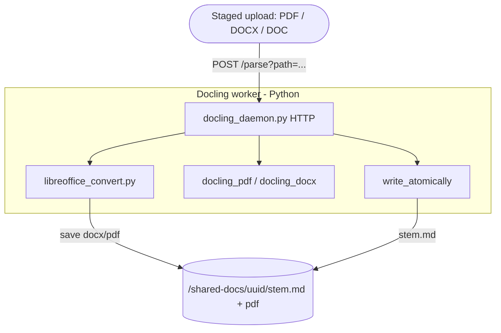
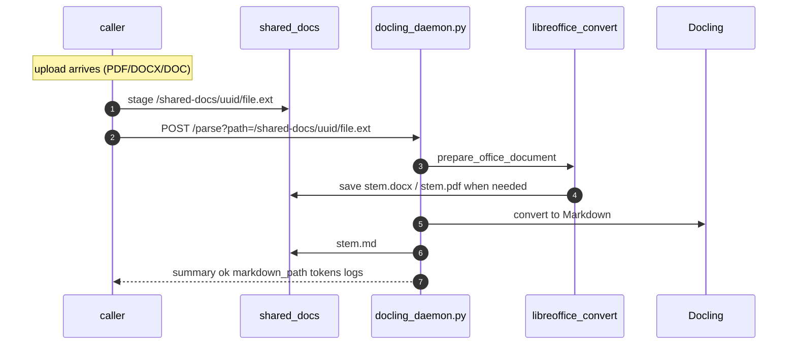

# Parsing Pipeline — How an upload becomes Markdown

A file (PDF / DOCX / DOC) is turned into one `<stem>.md`. The whole document goes downstream:
nothing here splits it. Everything runs in Python: LibreOffice prep, Docling conversion, and
all derived-file writes.

- **Source**: `modules/documents/processing/src/main/python/`

The file to parse must already be on the shared volume (`IAP_SHARED_DOCS`, `/shared-docs` in
the image). The caller stages it there and passes its **path**; the daemon never receives
document bytes.

---

## Big picture — who calls what



**Path-based round trip:** the caller stages the upload under `/shared-docs/{uuid}/`, then
`POST /parse?path=...`. Python runs LibreOffice (DOC/DOCX) and Docling, and writes
`{stem}.md`. The HTTP reply is a small summary only.

---

## The daemon flow, step by step



**There is no fallback processor.** Docling (daemon or CLI) is the only one. If Docling fails,
the parse fails.

### The `/parse` request

```
POST /parse?path=/shared-docs/.../file.pdf
```

`path` is required and is resolved against `IAP_SHARED_DOCS` (`resolve_parse_path`); the
request body is ignored. The daemon also serves `GET /health`, and `POST /shutdown` when
started with `--enable-shutdown`.

`/parse` and `/shutdown` change state, so both refuse any request carrying an `Origin`
header — nothing that legitimately drives the daemon is a web page, and loopback binding is
no defence when the browser runs on the same host. Setting `IAP_DOCLING_TOKEN` additionally
requires it as a bearer token on those two endpoints. `GET /health` stays open so container
probes need no credential.

**Set the token for anything but a bare `python docling_daemon.py` on your own machine.** In a
container the entrypoint has to bind `0.0.0.0`, because Docker forwards a published port no
other way, so every other container on the Compose network can reach the port — and reaching
it is authority to re-parse any staged upload and overwrite its Markdown.
`generate_compose.py --docling` generates one into `.env`. The daemon says so at startup
when it is unset, unless `IAP_DOCLING_TRUSTED_NETWORK` is set to say the port has been confined
some other way, which the daemon itself cannot see.

A failed conversion answers `500 {"error": …, "reference": …}`. The reason is not in the
reply: it is assembled from internals — `soffice`'s raw output, a Docling error quoting the
shared-docs path — so it goes to the container log against that reference.

One conversion runs at a time (`MAX_CONCURRENT_PARSES`), because the whole RAM budget is
calculated for a single conversion spread across the worker pool. A request arriving while
one is running is refused with `503 {"error": "daemon busy: …"}` rather than queued — a
conversion takes minutes, and holding the socket open for one that has not started only
invites client timeouts. Callers retry.

---

## Components

| Module | Role |
|---|---|
| `docling_daemon.py` | **`POST /parse?path=...`** under `IAP_SHARED_DOCS`, `GET /health`, `POST /shutdown` |
| `parse_document.py` | Shared orchestrator: LibreOffice prep → Docling → bookmark heading levels → write `{stem}.md` |
| `libreoffice_convert.py` | DOC→DOCX+PDF, DOCX→PDF; saves beside source immediately |
| `docling_parser.py` | CLI entry via `parse_document` |
| `docling_pdf_parser.py` | `convert_pdf_to_markdown` — page-sharded parallel Docling |
| `docling_docx_parser.py` | DOCX → Markdown (Docling; no page markers) |
| `docling_batch_sizing.py` | Worker-count / page-batch sizing from RAM + cores |
| `docling_config.py` / `docling_error_detection.py` | Shared Docling pipeline options; parse-failure detection |
| `markdown_cleanup.py` | `clean_markdown` — strip garbage lines, collapse blanks (idempotent). Called **once per document**, by the converter only |
| `markdown_markers.py` | The `<!-- page: N -->` format, the ATX heading rules, the accepted suffixes, and the `len//4` token estimate |
| `heading_levels.py` | `correct_heading_levels` — set the assembled Markdown's heading levels from the PDF's bookmarks |
| `pdf_bookmarks.py` | PDF bookmark extraction (pypdf) |
| `shared_docs.py` | The shared-docs allowlist, the input size ceilings, and every write to disk |

---

## Markdown generation

- **PDF (Docling)** — `convert_pdf_to_markdown` reads the page count with `pypdf`,
  splits the pages into batches, and converts each batch in a **separate worker process**
  (`ProcessPoolExecutor`), exporting Markdown **per page** with a `<!-- page: N -->` marker
  before each. Fragments are concatenated in page order. Those page-range batches are an
  internal parallelism detail — one document still produces one `.md`.
- **DOCX** — LibreOffice writes `{stem}.pdf`, then Docling converts the DOCX. No physical pages
  ⇒ no `<!-- page: N -->` markers (so `evidence.page` is null downstream).
- **DOC** — LibreOffice writes `{stem}.docx` and `{stem}.pdf`, then Docling converts the DOCX.

Every path ends the same way: `parse_document` corrects the heading levels, writes
`<answerDir>/<stem>.md` beside the staged source under `/shared-docs`, and reports its
`len//4` token estimate in the summary.

---

## Heading levels (`heading_levels.py`)

Docling's heading-hierarchy pass runs with `use_bookmarks` and `use_numbering` on (see
`docling_config.py`), but a PDF is converted as page-range batches in separate worker
processes, so that pass only ever sees one batch. No single process sees the whole document,
and the same section comes back `#` in one batch and `##` in another. Downstream that means a
quote is cited under the wrong section.

So the levels are settled after the batches are concatenated, from the one view of the whole
document there is: the PDF's bookmark outline.

```
correct_heading_levels(markdown, <stem>.md)
  ├─ find_sibling_pdf         # {stem}.pdf beside the .md -- the staged PDF itself, or
  │                           # LibreOffice's rendition of a DOC/DOCX. Suffix case is ignored
  │                           # (PROTOCOL.PDF is routine from Windows).
  │                           # none → the Markdown is returned as parsed
  ├─ extract_bookmarks        # pypdf outline → ordered {title, level, page}
  │                           # none, or unreadable → returned as parsed
  └─ apply_bookmark_heading_levels
         # one pass over the document indexed by normalized title (casefolded letters and
         # digits, section numbers kept), then one lookup per bookmark. ATX, bold and
         # ALL-CAPS lines can match; table rows and captions cannot. Closest page wins, ties
         # go to the later line. The line keeps its text; only its '#' count is set.
```

Pure regex/string work — no LLM, no Docling re-convert. It is linear in
lines × bookmarks and runs while the daemon still holds its only parse slot, so both are
capped (`MAX_BOOKMARKS`, `MAX_OUTLINE_DEPTH`).

A DOCX has no page markers, so every match sits at the same missing-page distance and the
later line wins. Levels are still corrected; only the tie-break weakens.

---

## On-disk artifacts (per answer)

```
<answerDir>/
    <stem>.md                 # the parsed Markdown
    <stem>.pdf                # the staged source, or the LibreOffice rendition, which is
                              # written unconditionally -- nothing checks the name first.
                              # Read back for its bookmark outline (see Heading levels).
```

### Staleness

A parse starts from a directory holding one staged upload and nothing else: the caller reads
every output into its own storage as soon as the parse finishes, then wipes the directory. So
this code only ever writes its own outputs, and nothing here checks for files an earlier run
left behind.

**The Markdown is written all-or-nothing.** `write_atomically` writes a temporary file in the
same directory and renames it into place, so a crash, a full disk or a kill can never leave a
half-written `.md` that looks finished. Nothing locks the directory, because nothing else is
writing to it: one parse owns one `/shared-docs/{uuid}/`, and the daemon runs one conversion
at a time.

### LibreOffice renditions

`prepare_office_document` writes `{stem}.docx` (for a `.doc`) and a best-effort `{stem}.pdf`
beside the source. That works because a parse owns its directory: the only `{stem}.pdf` there
is the one this run rendered, or the staged PDF itself when the upload was already a PDF.

`convert()` requires the expected file to exist afterwards, because `soffice` exits 0 having
converted nothing often enough to be worth checking.

---

## Run modes

| | Daemon | CLI / inline |
|---|---|---|
| Convert | Caller stages path under `/shared-docs`, `POST /parse?path=…` → `parse_document` | `docling_parser.py <file>` — same path |
| Files owned by | Python on the shared volume | Python (writes the `.md` itself) |

Both modes go through `parse_document`, so the conversion is identical.

---

## Key constants

| Constant | Value | Meaning |
|---|---|---|
| `DEFAULT_MAX_INPUT_PAGES` | 1500 | Largest PDF accepted; over it is a 400, raised *after* the parse slot is taken (counting pages means reading the document). Override with `IAP_MAX_INPUT_PAGES`, 0 to disable |
| `DEFAULT_MAX_INPUT_BYTES` | 64 MiB | The same ceiling by size, for every accepted type — a `.docx` has no pages to count. Override with `IAP_MAX_INPUT_BYTES` |
| `DEFAULT_MAX_EXPANDED_BYTES` | 512 MiB | And again after decompression, for a `.docx`, which is a zip: 64 MiB of repeated bytes expands to gigabytes, and Docling parses DOCX in the daemon's own process rather than a pool worker, so that memory is the daemon's. Override with `IAP_MAX_EXPANDED_BYTES`, 0 to disable |
| `DEFAULT_CONVERSION_TIMEOUT_SECONDS` | 300 | Seconds one `soffice` run may take before its process group is killed. Override with `IAP_LIBREOFFICE_TIMEOUT_SECONDS`. Per soffice *run*: a `.doc` does two (to `.docx`, then the sibling `.pdf`), so prep can take twice this. Sized for the byte ceiling above, and both runs together still sit well inside the container's `stop_grace_period` |
| `DEFAULT_DOCUMENT_TIMEOUT_SECONDS` | 600 | Seconds one Docling conversion may take, which is one page batch (at most `MAX_BATCH_PAGES`), not the whole document. Docling checks it between batches and stops with `PARTIAL_SUCCESS` plus a `TIMEOUT` error item, which `ensure_conversion_ok` already fails on, so a runaway document fails its batch rather than holding the daemon's only parse slot while `/health` still reports ready. Bounds a slow conversion, not one wedged inside a single page. Override with `IAP_DOCLING_DOCUMENT_TIMEOUT_SECONDS`, 0 to disable |
| `DEFAULT_PARSE_TIMEOUT_SECONDS` | 900 | Seconds the *whole* conversion may take, which is what a caller waits on: `DEFAULT_DOCUMENT_TIMEOUT_SECONDS` covers one batch of at most `MAX_BATCH_PAGES`, and a 1500-page document is up to 375 of them. A quarter of an hour, because somebody uploaded the document and is still there. Past it the remaining batches are abandoned; one that will not stop within `ABANDON_TIMEOUT_SECONDS` is reported as a broken pool, so `/health` starts failing and the container is restarted. Override with `IAP_DOCLING_PARSE_TIMEOUT_SECONDS`, 0 to disable |
| `ABANDON_TIMEOUT_SECONDS` | 120 | Seconds an abandoned page batch is given to stop before its worker is called wedged |
| `DEFAULT_PORT` | 18765 | Daemon HTTP port |
